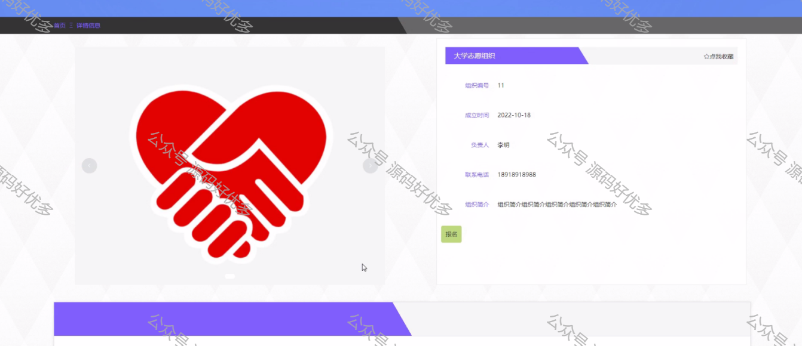
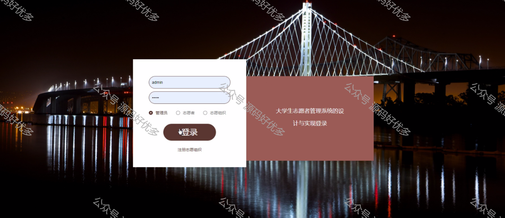

 
## 查看主页获取源码

> **作者介绍**： **✌**全网粉丝10W+本平台特邀作者、博客专家、CSDN新星计划导师、java领域优质创作者,博客之星、掘金/华为云/阿里云/InfoQ等平台优质作者、专注于项目实战 **✌**

  

### 一、作品包含

源码+数据库+设计文档万字+PPT+全套环境和工具资源+部署教程

### 二、项目技术

前端技术：Html、Css、Js、Vue、Element-ui

数据库：MySQL

后端技术：Java、Spring Boot、MyBatis

  

### 三、运行环境

开发工具：IDEA/eclipse

数据库：MySQL5.7

数据库管理工具：Navicat10以上版本

环境配置软件： JDK1.8+Maven3.6.3

前端Nodejs：14

  

### 四、项目介绍
项目编号：springbootA070

国内外科技信息技术大大提高，近年来，随着计算机技术的飞速发展以及其在全球范围内的普及，计算机技术的在人们生活中应用的占比越来越大，尤其是信息资源管理方面，广泛应用于各个行业，已经产生了不可估量的社会效益。计算机技术在信息资源管理方面的应用大大提高了工作效率，简化了工作程序。而这些特点正好对志愿者管理的难题对症下药。大学生志愿者管理系统一经问世，就展现了其巨大的发展前景与优势，大学生志愿者管理系统的发展重心也快速转向了利用计算机技术节省人力物力和节省开支，同时也为了更好地发挥更大的安全性、快速和理性的功能。大学生志愿者管理系统的形式包括组织风采、志愿活动、组织报名、活动报名等，既为用户提供服务，又可针对其特点实现对整个大学生志愿者管理系统的统一管理

### 五、运行截图

  
